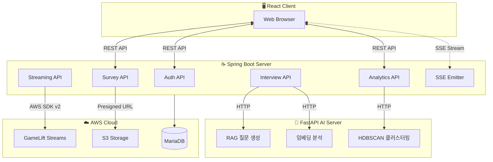
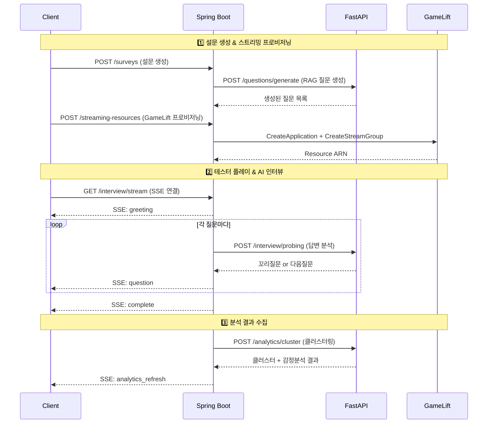
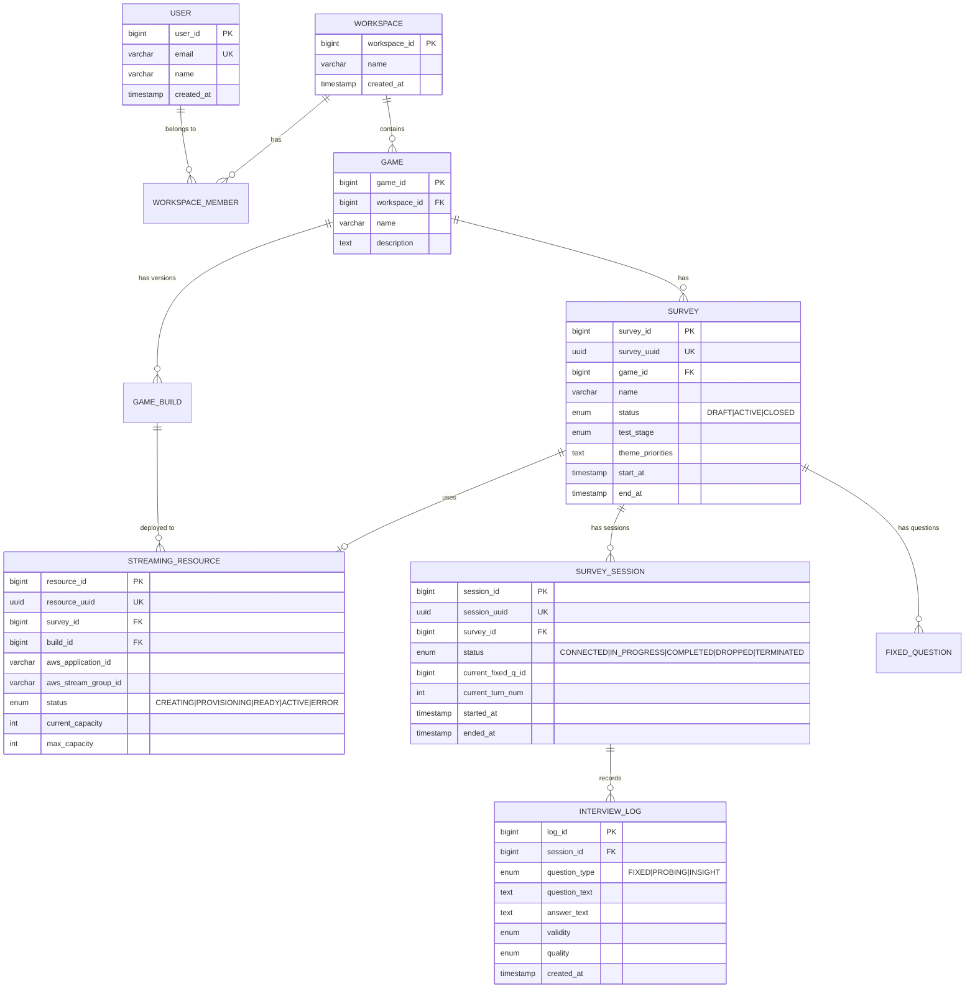

# 🎮 PlayProbie Server

> **AI 기반 게임 플레이테스트 플랫폼의 Backend API Server**

[](https://openjdk.org/)
[](https://spring.io/projects/spring-boot)
[](https://spring.io/projects/spring-security)
[](https://aws.amazon.com/sdk-for-java/)

---

## 📖 프로젝트 소개

**PlayProbie**는 **게임 개발사**가 플레이테스트를 설계하고, **테스터**가 브라우저에서 게임을 플레이한 뒤 **AI 인터뷰**를 통해 심층 피드백을 수집하는 **올인원 플레이테스트 솔루션**입니다.

이 서버는 **React 클라이언트**와 **FastAPI AI 서버** 사이에서 **핵심 비즈니스 로직**을 담당하며, 다음 역할을 수행합니다:

| 역할 | 설명 |
|------|------|
| 🔐 **인증/인가** | JWT 기반 사용자 인증 및 워크스페이스 권한 관리 |
| 📋 **설문 관리** | 테마 기반 설문 설계, 상태 전이(DRAFT→ACTIVE→CLOSED) |
| 🎮 **스트리밍 오케스트레이션** | AWS GameLift Streams 리소스 프로비저닝 및 JIT 할당 |
| 🤖 **AI 서버 통합** | FastAPI AI 서버와의 비동기 통신 (질문 생성, 분석) |
| 📡 **실시간 통신** | SSE 기반 AI 인터뷰 스트리밍 및 분석 결과 알림 |
| 📊 **데이터 분석** | 클러스터링, 감정 분석 결과 집계 및 대시보드 데이터 제공 |

---

## 🏗️ 시스템 아키텍처



### 데이터 흐름



---

## 🛠️ 기술 스택

### Core Framework

| 기술 | 버전 | 선택 이유 |
|------|------|----------|
| **Java** | 21 LTS | Virtual Threads 지원, 최신 LTS |
| **Spring Boot** | 3.5.9 | 안정적인 엔터프라이즈 프레임워크 |
| **Gradle** | Wrapper | 빠른 빌드, 유연한 의존성 관리 |

### Backend Dependencies

| 라이브러리 | 용도 |
|-----------|------|
| `spring-boot-starter-web` | REST API 개발 |
| `spring-boot-starter-data-jpa` | ORM (JPA/Hibernate) |
| `spring-boot-starter-security` | 인증/인가 |
| `spring-boot-starter-webflux` | 비동기 HTTP 클라이언트 (WebClient) |
| `spring-boot-starter-validation` | Bean Validation |
| `springdoc-openapi` | Swagger UI API 문서화 |
| `jjwt` | JWT 토큰 생성/검증 |
| `shedlock` | 분산 스케줄링 락 (다중 인스턴스 환경) |

### AWS Integration

| 서비스 | SDK | 용도 |
|--------|-----|------|
| **GameLift Streams** | `gameliftstreams` | 클라우드 게임 스트리밍 |
| **S3** | `s3` | 게임 빌드 파일 저장 |
| **STS** | `sts` | 임시 자격 증명 발급 |

### Database

| 환경 | Database | 비고 |
|------|----------|------|
| local | H2 (In-Memory) | 빠른 개발 사이클 |
| dev/prod | MariaDB | AWS RDS |

---

## ✨ 핵심 기능 & 기술적 도전

### 1. SSE 기반 실시간 AI 인터뷰 시스템

> **문제**: AI 서버의 응답 시간이 수 초~수십 초에 달하며, 클라이언트가 실시간으로 인터뷰 진행 상황을 확인해야 함

**해결 방안**:
- **Server-Sent Events (SSE)** 를 활용한 단방향 실시간 스트리밍 구현
- `SseEmitter`를 통한 이벤트 타입별 분기 (`greeting_continue`, `greeting_done`, `question`, `reaction`, `interview_complete`)
- **꼬리질문(Probing) 제어**: 서버 주도의 인터뷰 상태 관리로 무한 루프 방지

```
관련 커밋:
- feat: SSE기반 실시간 설문 진행 기능 구현 (#17)
- feat: 인터뷰 SSE 이벤트에 꼬리질문 제어 필드 추가 (#92)
- fix: SSE 연결 끊김(Race Condition) 및 좀비 스트림 문제 해결 (#176)
```

### 2. AWS GameLift Streams 온디맨드 리소스 관리

> **문제**: 플레이테스트 기간에만 클라우드 게임 스트리밍이 필요하며, 비용 최적화와 빠른 프로비저닝이 필수

**해결 방안**:
- **JIT(Just-In-Time) 프로비저닝**: 설문 활성화 시점에 GameLift Application + StreamGroup 생성
- **Two-Phase Transaction Pattern**: DB 상태 변경과 AWS API 호출 분리로 일관성 보장
- **비동기 스케일링**: 스케일업/다운 요청을 비동기로 처리하여 API 응답 시간 단축
- **Race Condition 해결**: 동시 테스터 접속 시 리소스 할당 충돌 방지

```
관련 커밋:
- feat: GameLift Streams 기반 온디맨드 리소스 할당 및 테스터 접속 환경 구현 (#53)
- fix: 스트리밍 리소스 생성 레이스 컨디션 해결 (#114)
- refactor: Streaming 서비스 DB 커넥션 고갈 방지 및 안정성 개선 (#164)
```

### 3. 서버 주도 인터뷰 상태 머신

> **문제**: 클라이언트 주도 상태 관리 시 중복 요청, 상태 불일치 문제 발생

**해결 방안**:
- `SurveySession` 엔티티에 현재 질문 ID, 순서, 턴 번호를 서버에서 관리
- **상태 전이 메서드** (`connect()`, `disconnectStream()`, `complete()`) 로 비즈니스 규칙 캡슐화
- 종료된 세션에 대한 추가 요청 거부로 데이터 무결성 보장

```
관련 커밋:
- Fix: 종료된 인터뷰 세션 보호, 서버 주도 인터뷰 상태 관리하도록 개선 (#111)
- feat: 인터뷰 세션 이어하기/업데이트 기능 구현 (#99)
```

### 4. AI 서버 통합 및 장애 대응

> **문제**: AI 서버 응답 지연 및 장애 시 전체 시스템 영향 최소화 필요

**해결 방안**:
- **WebClient 기반 비동기 HTTP 통신** (Reactor)
- **타임아웃 설정 분리**: 환경변수로 read-timeout 관리 (`AI_CLIENT_READ_TIMEOUT`)
- **Health Check API**: AI 서버 상태 모니터링
- **Graceful Degradation**: AI 장애 시 기본 질문 세트 제공

```
관련 커밋:
- chore: AI client read-timeout을 환경변수로 분리 (#144)
- feat: MockDataLoader구현 및 AI서버 HealthCheck 추가 (#124)
```

### 5. 분산 환경 스케줄링 (ShedLock)

> **문제**: 다중 인스턴스 배포 시 스케줄러 중복 실행 방지

**해결 방안**:
- **ShedLock + JDBC** 기반 분산 락 구현
- 스트리밍 리소스 정리, 세션 타임아웃 처리 등 주기적 작업에 적용

---

## 📂 프로젝트 구조

```
src/main/java/com/playprobie/api/
├── domain/                    # 도메인별 패키지 (DDD 기반)
│   ├── analytics/            # 📊 분석 (클러스터링, 감정분석)
│   │   ├── api/              # Controller
│   │   ├── application/      # Service
│   │   ├── dao/              # Repository
│   │   ├── domain/           # Entity, VO
│   │   └── dto/              # Request/Response DTO
│   ├── auth/                 # 🔐 인증 (JWT, OAuth)
│   ├── game/                 # 🎮 게임/빌드 관리
│   ├── interview/            # 🎤 AI 인터뷰 세션
│   ├── replay/               # 📹 플레이 리플레이
│   ├── streaming/            # ☁️ GameLift 스트리밍
│   ├── survey/               # 📋 설문 설계/관리
│   ├── user/                 # 👤 사용자
│   └── workspace/            # 🏢 워크스페이스
├── global/                   # 공통 모듈
│   ├── config/               # Security, WebClient 설정
│   ├── domain/               # BaseTimeEntity 등
│   ├── error/                # 예외 처리 (GlobalExceptionHandler)
│   └── converter/            # JPA Converter
└── infra/                    # 인프라 계층
    ├── ai/                   # FastAPI 클라이언트
    ├── gamelift/             # AWS GameLift SDK 래퍼
    └── sse/                  # SSE 이벤트 관리
```

---

## 📊 데이터베이스 스키마



---

## 📡 API 문서

### Swagger UI

개발 서버 실행 후 아래 URL에서 API 명세를 확인할 수 있습니다:

```
http://localhost:8080/swagger-ui/index.html
```

### 주요 API 엔드포인트

| 도메인 | 메서드 | 엔드포인트 | 설명 |
|--------|--------|-----------|------|
| **Auth** | POST | `/auth/login` | 로그인 (JWT 발급) |
| **Survey** | POST | `/surveys` | 설문 생성 |
| **Survey** | PATCH | `/surveys/{id}/status` | 설문 상태 변경 |
| **Interview** | GET | `/surveys/{id}/sessions/{sessionId}/stream` | SSE 인터뷰 스트림 |
| **Interview** | POST | `/surveys/{id}/sessions/{sessionId}/answer` | 답변 제출 |
| **Streaming** | POST | `/streaming-resources` | 스트리밍 리소스 생성 |
| **Analytics** | GET | `/surveys/{id}/analytics` | 분석 결과 조회 |

---

## 🚀 빠른 시작

### 요구 사항

- Java 21+
- Gradle 8.x (또는 Gradle Wrapper 사용)

### 설치 및 실행

```bash
# 1. 저장소 클론
git clone https://github.com/PlayProbie/server.git
cd server

# 2. 로컬 환경 실행 (H2 DB)
./gradlew bootRun

# 3. 테스트 실행
./gradlew test

# 4. 빌드
./gradlew build
```

### 환경 변수

| 변수명 | 설명 | 기본값 |
|--------|------|--------|
| `SPRING_PROFILES_ACTIVE` | 활성 프로파일 | `local` |
| `AI_SERVER_URL` | FastAPI AI 서버 URL | `http://localhost:8000` |
| `AI_CLIENT_READ_TIMEOUT` | AI 서버 읽기 타임아웃 (ms) | `30000` |
| `JWT_SECRET` | JWT 서명 키 | - |
| `AWS_ACCESS_KEY_ID` | AWS 액세스 키 | - |
| `AWS_SECRET_ACCESS_KEY` | AWS 시크릿 키 | - |

---

## 📚 관련 문서

- [Client Repository](https://github.com/PlayProbie/client) - React 프론트엔드
- [AI Server Repository](https://github.com/PlayProbie/ai) - FastAPI AI 서버 (LangGraph, RAG)

---

## 🧑‍💻 개발 컨벤션

- **코드 포맷**: Naver Eclipse Formatter (Spotless)
- **커밋 메시지**: Conventional Commits (`feat:`, `fix:`, `refactor:`, `chore:`)
- **브랜칭 전략**: `feat/#issue`, `fix/#issue`

---

<p align="center">
  <sub>Built with ☕ Spring Boot by PlayProbie Team</sub>
</p>