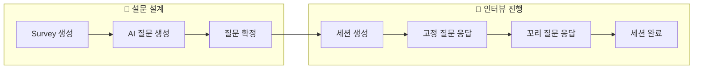
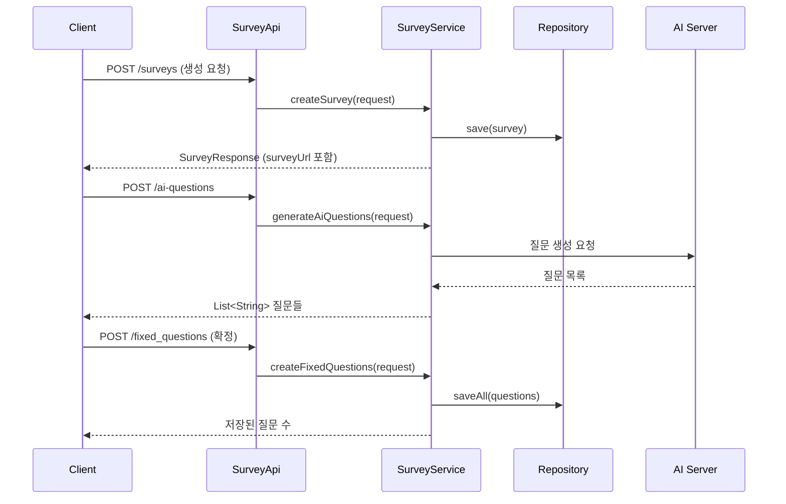
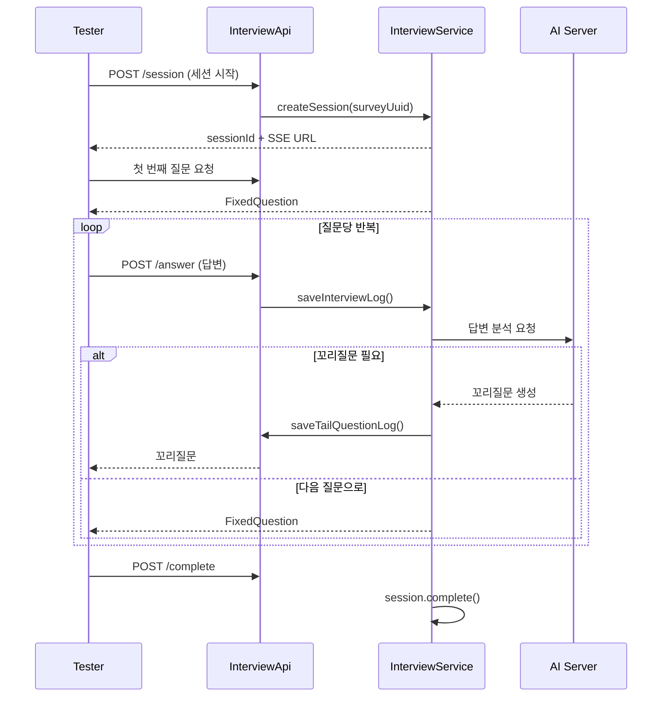

# 🎮 PlayProbie 서버 온보딩 가이드

> **담당 영역**: 설문 설계 → 인터뷰 진행  
> **대상 독자**: Spring 입문자

---

## 1. 프로젝트 개요

PlayProbie는 게임 사용자 테스트를 위한 AI 기반 인터뷰 플랫폼입니다.

### 핵심 플로우



### 당신이 담당하는 영역

| 도메인 | 설명 | 핵심 파일 |
|--------|------|-----------|
| `survey` | 설문 및 질문 관리 | `SurveyService.java`, `Survey.java` |
| `interview` | 인터뷰 세션 진행 | `InterviewService.java`, `SurveySession.java` |

---

## 2. 기술 스택 (먼저 알아야 할 것들)

| 기술 | 버전 | 용도 |
|------|------|------|
| **Java** | 21 (LTS) | 언어 |
| **Spring Boot** | 3.5.9 | 프레임워크 |
| **Spring Data JPA** | - | DB 접근 (ORM) |
| **H2 Database** | - | 로컬 개발용 인메모리 DB |
| **Lombok** | - | 보일러플레이트 코드 감소 |

### 🚀 빠른 시작

```bash
# 개발 서버 실행
./gradlew bootRun

# 테스트
./gradlew test

# H2 콘솔 접속 (서버 실행 중)
# http://localhost:8080/h2-console
```

---

## 3. 프로젝트 구조 이해하기

### 전체 패키지 구조

```
src/main/java/com/playprobie/api/
├── domain/                    # 📦 도메인별 패키지
│   ├── survey/                # 설문 도메인 ⬅️ 담당
│   │   ├── api/               # Controller (REST API)
│   │   ├── application/       # Service (비즈니스 로직)
│   │   ├── dao/               # Repository (DB 접근)
│   │   ├── domain/            # Entity (JPA)
│   │   ├── dto/               # Request/Response 객체
│   │   └── exception/         # 도메인 전용 예외
│   │
│   └── interview/             # 인터뷰 도메인 ⬅️ 담당
│       ├── api/
│       ├── application/
│       ├── dao/
│       ├── domain/
│       └── dto/
│
├── global/                    # 🌐 전역 설정
│   ├── config/                # Spring 설정
│   └── error/                 # 예외 처리
│
└── infra/                     # 🔌 외부 인프라
    └── ai/                    # AI 서버 연동
```

### 왜 이렇게 구성했나?

> **도메인형 구조**: 기능 단위가 아닌 **비즈니스 도메인** 단위로 패키지를 나눕니다.  
> 장점: 특정 도메인을 수정할 때 관련 파일들이 한 곳에 모여있어 찾기 쉽습니다.

---

## 4. Spring 핵심 개념 (3분 요약)

### 4.1 레이어드 아키텍처

```
HTTP 요청
    ↓
┌─────────────────────────────────────────────┐
│  Controller (API)                           │  ← 요청/응답 처리
│  @RestController, @GetMapping 등            │
└─────────────────────────────────────────────┘
    ↓
┌─────────────────────────────────────────────┐
│  Service (Application)                      │  ← 비즈니스 로직
│  @Service, @Transactional                   │
└─────────────────────────────────────────────┘
    ↓
┌─────────────────────────────────────────────┐
│  Repository (DAO)                           │  ← DB 접근
│  JpaRepository 상속                          │
└─────────────────────────────────────────────┘
    ↓
┌─────────────────────────────────────────────┐
│  Entity (Domain)                            │  ← DB 테이블 매핑
│  @Entity                                    │
└─────────────────────────────────────────────┘
```

### 4.2 의존성 주입 (DI)

```java
// ❌ 직접 생성 (하지 마세요)
private SurveyService surveyService = new SurveyService();

// ✅ 생성자 주입 (Spring이 자동으로 관리)
@RequiredArgsConstructor  // Lombok이 생성자 자동 생성
@Service
public class InterviewService {
    private final SurveyRepository surveyRepository;  // Spring이 주입
}
```

### 4.3 트랜잭션 (@Transactional)

```java
@Transactional  // 메서드 내 DB 작업을 하나의 트랜잭션으로 묶음
public void createSurvey() {
    // 실패 시 모든 변경사항 롤백
}

@Transactional(readOnly = true)  // 조회 전용 (성능 최적화)
public Survey getSurvey(Long id) { ... }
```

---

## 5. 담당 도메인 상세 분석

### 5.1 Survey 도메인 (설문 설계)

#### Entity 구조

```java
// Survey.java (설문)
@Entity
public class Survey {
    @Id
    @GeneratedValue(strategy = GenerationType.IDENTITY)
    private Long id;
    
    @Column(unique = true)
    private UUID uuid;              // 외부 공개용 식별자
    
    @ManyToOne(fetch = FetchType.LAZY)
    private Game game;              // 연결된 게임
    
    private String name;            // 설문 이름
    private String surveyUrl;       // 접속 URL
    
    @Enumerated(EnumType.STRING)
    private TestPurpose testPurpose;  // 테스트 목적
    
    private LocalDateTime startAt;   // 시작일
    private LocalDateTime endAt;     // 종료일
    
    // 비즈니스 메서드
    public boolean isOpen() {
        LocalDateTime now = LocalDateTime.now();
        return now.isAfter(startAt) && now.isBefore(endAt);
    }
}
```

```java
// FixedQuestion.java (고정 질문)
@Entity
public class FixedQuestion {
    private Long surveyId;          // 설문 ID (FK)
    private String content;         // 질문 내용
    private Integer order;          // 순서
    
    @Enumerated(EnumType.STRING)
    private QuestionStatus status;  // DRAFT / CONFIRMED
}
```

#### API 엔드포인트

| Method | URL | 설명 |
|--------|-----|------|
| `POST` | `/api/v1/surveys` | 설문 생성 |
| `GET` | `/api/v1/surveys/{id}` | 설문 조회 |
| `POST` | `/api/v1/surveys/ai-questions` | AI 질문 생성 (미리보기) |
| `POST` | `/api/v1/surveys/fixed_questions` | 질문 확정 저장 |
| `GET` | `/api/v1/surveys/{id}/questions` | 확정된 질문 목록 |

#### 핵심 로직 흐름



---

### 5.2 Interview 도메인 (인터뷰 진행)

#### Entity 구조

```java
// SurveySession.java (인터뷰 세션)
@Entity
public class SurveySession {
    private UUID uuid;              // 세션 식별자
    
    @ManyToOne
    private Survey survey;          // 연결된 설문
    
    @Embedded
    private TesterProfile testerProfile;  // 테스터 정보
    
    @Enumerated(EnumType.STRING)
    private SessionStatus status;   // IN_PROGRESS / COMPLETED / DROPPED
    
    private LocalDateTime startedAt;
    private LocalDateTime endedAt;
    
    // 상태 전이 메서드
    public void complete() {
        if (this.status.isFinished()) {
            throw new IllegalStateException("이미 종료된 세션입니다.");
        }
        this.status = SessionStatus.COMPLETED;
        this.endedAt = LocalDateTime.now();
    }
}
```

```java
// InterviewLog.java (응답 기록)
@Entity
public class InterviewLog {
    private Long fixedQuestionId;   // 고정 질문 ID
    private Integer turnNum;        // 턴 번호 (1: 고정질문, 2+: 꼬리질문)
    
    @Enumerated(EnumType.STRING)
    private QuestionType type;      // FIXED / TAIL
    
    private String questionText;    // 질문 내용
    private String answerText;      // 답변 내용
}
```

#### API 엔드포인트

| Method | URL | 설명 |
|--------|-----|------|
| `POST` | `/api/v1/interviews/session` | 세션 생성 |
| `GET` | `/api/v1/interviews/{surveyId}/{sessionId}` | 히스토리 조회 |
| `POST` | `/api/v1/interviews/answer` | 답변 저장 |
| `POST` | `/api/v1/interviews/complete` | 세션 완료 |

#### 인터뷰 진행 흐름



---

## 6. 코드 작성 규칙

### 6.1 네이밍 규칙

| 유형 | 패턴 | 예시 |
|------|------|------|
| **Controller** | `[도메인]Api` | `SurveyApi`, `InterviewApi` |
| **Service** | `[도메인]Service` | `SurveyService` |
| **Repository** | `[도메인]Repository` | `SurveyRepository` |
| **Entity** | `[도메인]` (단수형) | `Survey`, `FixedQuestion` |
| **DTO** | `[동작][도메인]Request/Response` | `CreateSurveyRequest` |
| **Exception** | `[도메인][상황]Exception` | `SurveyNotFoundException` |

### 6.2 메서드명 규칙

```java
// Controller
@GetMapping("/{id}")
public UserResponse getUser() { }     // GET 단건

@GetMapping
public List<UserResponse> getUsers() { }  // GET 목록

@PostMapping
public UserResponse createUser() { }  // POST

// Service
public User findById(Long id) { }     // 단건 조회
public List<User> findAll() { }       // 목록 조회
public User create(Request req) { }   // 생성
public void update(Long id, Request req) { }  // 수정
public void delete(Long id) { }       // 삭제
```

### 6.3 Entity 작성 규칙

```java
@Entity
@Getter
@NoArgsConstructor(access = AccessLevel.PROTECTED)  // JPA 필수
public class Survey extends BaseTimeEntity {
    
    // ❌ Setter 사용 금지
    // public void setName(String name) { ... }
    
    // ✅ 의미있는 비즈니스 메서드 사용
    public void updateName(String newName) {
        this.name = newName;
    }
    
    // ✅ Builder 패턴 사용
    @Builder
    public Survey(Game game, String name) {
        this.game = Objects.requireNonNull(game);
        this.name = Objects.requireNonNull(name);
        this.uuid = UUID.randomUUID();  // 기본값 설정
    }
}
```

### 6.4 예외 처리 패턴

```java
// 1. 도메인별 Exception 클래스 생성
// domain/survey/exception/SurveyNotFoundException.java
public class SurveyNotFoundException extends EntityNotFoundException {
    public SurveyNotFoundException() {
        super(ErrorCode.SURVEY_NOT_FOUND);
    }
}

// 2. Service에서 예외 발생
public Survey getSurveyEntity(Long surveyId) {
    return surveyRepository.findById(surveyId)
        .orElseThrow(EntityNotFoundException::new);
}

// 3. GlobalExceptionHandler가 자동으로 처리
// → 일관된 형식의 ErrorResponse 반환
```

---

## 7. 실전: 새 기능 추가하기

### 예제: 설문 삭제 기능 추가

#### Step 1: API 설계

| Method | URL | 응답 코드 |
|--------|-----|-----------|
| `DELETE` | `/api/v1/surveys/{id}` | 204 No Content |

#### Step 2: 코드 작성

```java
// 1. Controller (api/SurveyApi.java)
@DeleteMapping("/{surveyId}")
public ResponseEntity<Void> deleteSurvey(@PathVariable Long surveyId) {
    surveyService.delete(surveyId);
    return ResponseEntity.noContent().build();
}

// 2. Service (application/SurveyService.java)
@Transactional
public void delete(Long surveyId) {
    Survey survey = surveyRepository.findById(surveyId)
        .orElseThrow(SurveyNotFoundException::new);
    
    // 비즈니스 규칙 검증
    if (survey.hasActiveSessions()) {
        throw new SurveyHasActiveSessionsException();
    }
    
    surveyRepository.delete(survey);
}

// 3. Exception (exception/SurveyHasActiveSessionsException.java)
public class SurveyHasActiveSessionsException extends BusinessException {
    public SurveyHasActiveSessionsException() {
        super(ErrorCode.SURVEY_HAS_ACTIVE_SESSIONS);
    }
}

// 4. ErrorCode에 추가 (global/error/ErrorCode.java)
SURVEY_HAS_ACTIVE_SESSIONS(400, "SV003", "진행 중인 세션이 있어 삭제할 수 없습니다.")
```

---

## 8. 자주 마주치는 패턴

### 8.1 Optional 처리

```java
// ❌ Bad: null 체크
Survey survey = repository.findById(id);
if (survey == null) {
    throw new SurveyNotFoundException();
}

// ✅ Good: orElseThrow 사용
Survey survey = repository.findById(id)
    .orElseThrow(SurveyNotFoundException::new);
```

### 8.2 Stream API 활용

```java
// 엔티티 → DTO 변환
List<FixedQuestionResponse> responses = questions.stream()
    .map(FixedQuestionResponse::from)
    .toList();

// 필터링
List<Survey> openSurveys = surveys.stream()
    .filter(Survey::isOpen)
    .toList();
```

### 8.3 Record (Java 14+)

```java
// DTO는 record로 간결하게
public record CreateSurveyRequest(
    Long gameId,
    String surveyName,
    String testPurpose,
    OffsetDateTime startedAt,
    OffsetDateTime endedAt
) { }

// 정적 팩토리 메서드
public record SurveyResponse(Long id, String name, String surveyUrl) {
    public static SurveyResponse from(Survey survey) {
        return new SurveyResponse(
            survey.getId(),
            survey.getName(),
            survey.getSurveyUrl()
        );
    }
}
```

---

## 9. 디버깅 팁

### H2 Console 접속

1. 서버 실행: `./gradlew bootRun`
2. 브라우저: `http://localhost:8080/h2-console`
3. JDBC URL: `jdbc:h2:mem:testdb`

### 로그 보기

```java
// Slf4j 로깅
@Slf4j
@Service
public class InterviewService {
    public void saveLog() {
        log.info("Session completed: {}", sessionUuid);
        log.debug("Detailed info: {}", detailData);
        log.error("Error occurred", exception);
    }
}
```

### API 테스트

- **Swagger UI**: `http://localhost:8080/swagger-ui/index.html`
- 모든 API 문서와 테스트 기능 제공

---

## 10. 참고 문서

| 문서 | 경로 | 설명 |
|------|------|------|
| 프로젝트 구조 | `.agent/instructions/project_structure.md` | 패키지 상세 설명 |
| API 설계 가이드 | `.agent/instructions/api_design.md` | REST API 규칙 |
| 네이밍 규칙 | `.agent/instructions/naming_conventions.md` | 이름 짓기 규칙 |
| Entity 규칙 | `.agent/instructions/entity_conventions.md` | Entity 작성법 |
| Git 컨벤션 | `.agent/instructions/git_conventions.md` | 커밋/브랜치 규칙 |

---

## ✅ 체크리스트: 시작하기 전에

- [ ] JDK 21 설치 확인
- [ ] IntelliJ IDEA + Lombok 플러그인 설치
- [ ] `./gradlew bootRun` 실행 확인
- [ ] H2 Console 접속 확인
- [ ] Swagger UI 접속 확인
- [ ] `.agent/instructions/` 문서 읽기 완료

---

> **질문이 있으면?**  
> 코드에서 이해 안 되는 부분이 있다면 해당 파일의 주석과 테스트 코드를 먼저 확인해보세요!
